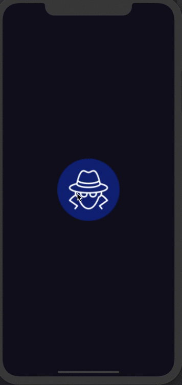
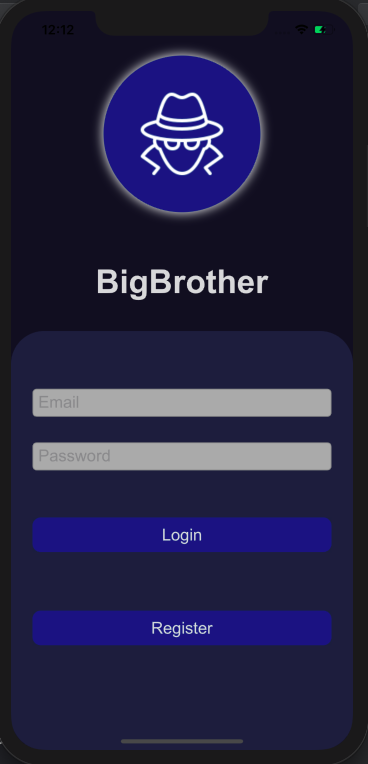
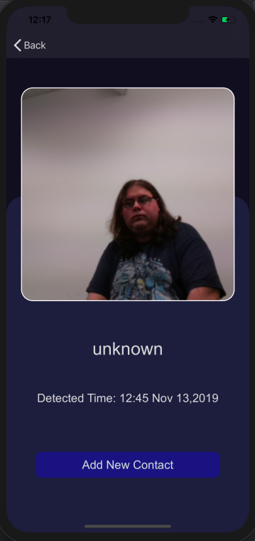
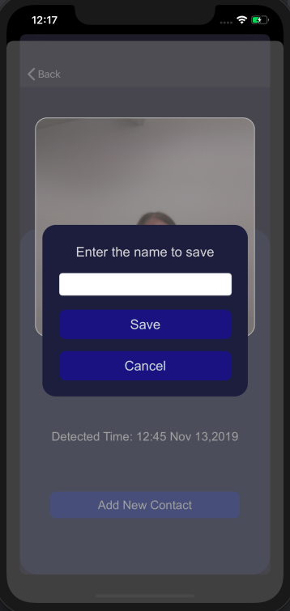
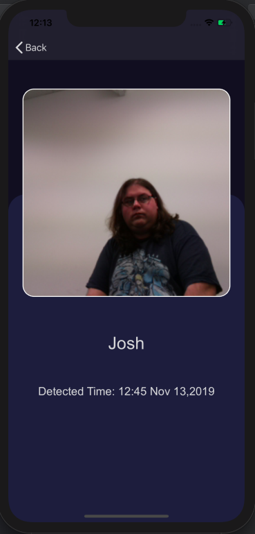

# BigBrother

BigBrother was the final project for our FIT5140 project. BigBrother is an iOS application for an IoT surveillence system with motion detection and facial recognition.

## What I learned
* programatically change views depending on different situtations
* using user defaults to persist values and states like settings
* using IBInspectables to expose different attributes of UI elements for setting design properties
* using simple and chaining core animations for better user experience
* making code more change friendly using extensions, subclassing, defining constants etc

The color palette for this project was inspired by https://dribbble.com/shots/7867164-Vortex-a-new-way-of-messaging  
The icons and logo for this project are taken from icon8 https://icons8.com/
